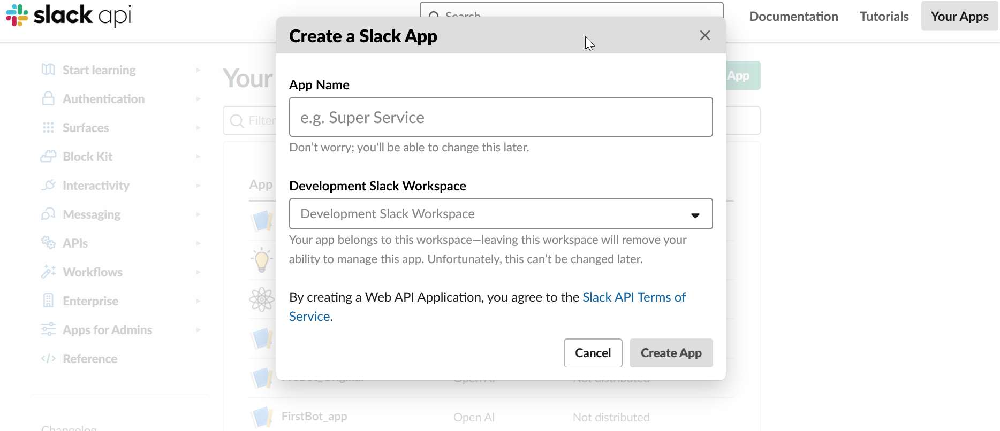

# README

## ProBotslackapp

It is slack Bot as named 'Professional Bot \(ProBot\)'. Slash commands and reminders and more.. Setup Clone the repository

## Built With

Node.js - Runtime environment Express.js - Node.js web application framework Heroku - Web hosting platform

## Installation:

Clone this repository using Git:

git clone : [https://github.com/Naagraju/ProBotslackapp.git](https://github.com/Naagraju/ProBotslackapp.git)

Install Node and NPM on your system, then install dependencies.

npm install

Now create a free developer account with Slack API.

Create a new app:

Slack step 1 

Choose the features and functionality of the app. You will need to select Incoming Webhooks, Bots, Event Subscriptions, and Permissions at the minimum.

Screenshot of Slack step 2

Set up App Credentials. You will need the App ID, Client ID, Client Secret, Signing Secret, and Verification Token. Keep this information private.

Update the display information. Load your bot's avatar and bio here:

Screenshot of Slack step 4

Now return to your code project and update the .env file with your tokens. You will need your Slack token from your Slack workspace.

